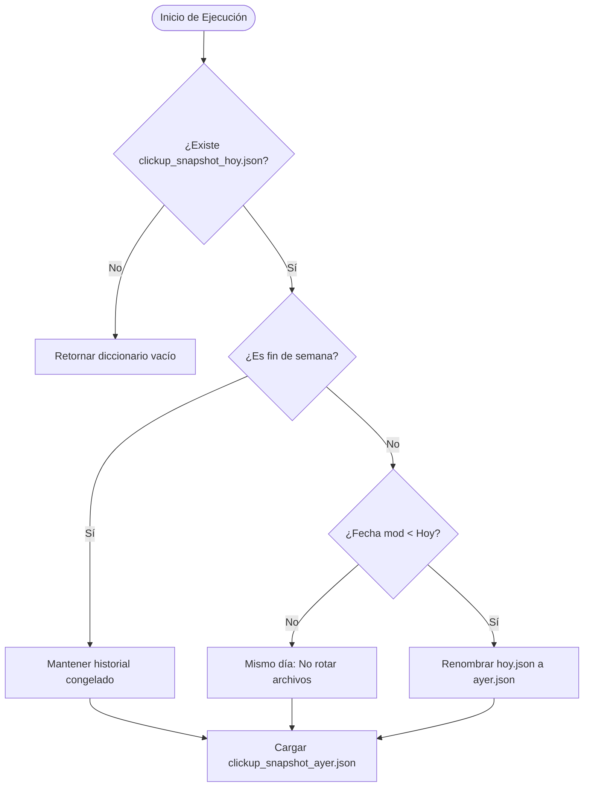

# Explicación: Ciclo de Vida de Snapshots y Detección de Diferencias

Este documento analiza el modelo conceptual y las decisiones de diseño que fundamentan el sistema de persistencia, auditoría de cambios y clasificación de tareas.

---

## 1. El Problema del Estado en la Generación de Changelogs

Para determinar qué ha cambiado en las tareas académicas (nuevas asignaciones, fechas postergadas, tareas completadas), el sistema requiere comparar dos puntos en el tiempo:
1. **Estado Base (Ayer):** El estado en que se encontraban las tareas en la última sesión de un día hábil previo.
2. **Estado Actual (Hoy):** Las tareas consultadas en tiempo real desde la API de ClickUp.

En lugar de requerir un motor de base de datos pesado, el sistema implementa una persistencia ligera basada en dos archivos JSON locales: `clickup_snapshot_ayer.json` y `clickup_snapshot_hoy.json`.

---

## 2. Mecanismo de Rotación Automática de Snapshots

La rotación de archivos se gestiona en [modulos/memoria.py](../../modulos/memoria.py) dentro de la función `cargar_tareas_ayer()`:



### Reglas clave de rotación:
- **Detección por Fecha de Modificación (`getmtime`):** Si la fecha del archivo `hoy` no coincide con la fecha actual del reloj del sistema, significa que es el primer uso del día. El archivo de `hoy` pasa a ser el de `ayer`.
- **Protección de Fines de Semana:** Los días sábado (`weekday == 5`) y domingo (`weekday == 6`) el sistema congela la rotación y la escritura. Esto evita que consultas casuales en fin de semana borren el estado del viernes, asegurando que el lunes por la mañana la comparación se realice contra el viernes.

---

## 3. Clasificación de Tareas y Reglas de Negocio

La función `generar_texto_changelog` en [modulos/changelog.py](../../modulos/changelog.py) evalúa cada tarea bajo las siguientes reglas prioritarias:

### A. Filtrado de Tareas Ignoradas
Si una tarea contiene la etiqueta `personal` (definida en `ETIQUETAS_IGNORADAS`), se omite completamente del reporte y de la tabla visual.

### B. Detección de Tareas Archivadas / Desaparecidas
Si un identificador de tarea existía en `tareas_ayer` pero ya no se encuentra en `tareas_hoy` y su estado anterior no era de finalización, se clasifica como:
```text
• *Nombre de Tarea* (Materia) se completó (archivada/cerrada).
```

### C. Autocompletado por Inactividad (Tareas Vencidas)
Si una tarea no tiene un estado de finalización pero su fecha límite (`due_date`) es estrictamente anterior a la fecha de hoy, el sistema reclasifica su estado a completado por inactividad:
```text
• *Nombre de Tarea* (Materia) se completó por inactividad.
```

### D. Tareas Creadas y Completadas en el Mismo Día
Si una tarea fue creada hoy (`date_created == hoy_date`) y simultáneamente posee estado completado, se registra como:
```text
• *Nombre de Tarea* (Materia) se creó y completó el día de hoy.
```

### E. Tareas Nuevas Activas
Si la tarea fue creada hoy y permanece abierta:
```text
• *Nombre de Tarea* (Materia) se agregó a la lista con etiqueta *[tags]* y fecha límite para el *[Fecha Relativa]*.
```

### F. Auditoría de Modificaciones
Si la tarea ya existía en el snapshot anterior y no está finalizada, se comparan sus campos individuales mediante `auditar_cambios`:
- **Nombre:** Detección de cambios de título.
- **Fecha Límite:** Detección de postergaciones o adelantos formateados con fechas relativas naturales.
- **Etiquetas:** Detección de adición, remoción o reemplazo de etiquetas.

---

## 4. Formato de Fechas Relativas en Español

Para facilitar la lectura humana, las fechas se transforman en expresiones naturales:
- Mismo día: `Hoy` o `Hoy a las HH:MM`.
- Día siguiente: `Mañana` o `Mañana a las HH:MM`.
- Dentro de la ventana de 7 días: Nombre del día (`Lunes`, `Martes`, etc.).
- Fechas lejanas: `DD/MM/YYYY`.

---

## Documentación Relacionada

- [Flujo y procesamiento de tareas](flujo-y-procesamiento-de-tareas.md)
- [Referencia técnica de módulos](../reference/arquitectura-y-modulos.md)
- [Guía de configuración de reglas](../how-to/como-personalizar-reglas-y-etiquetas.md)
- [Volver al inicio del proyecto](../../README.md)
