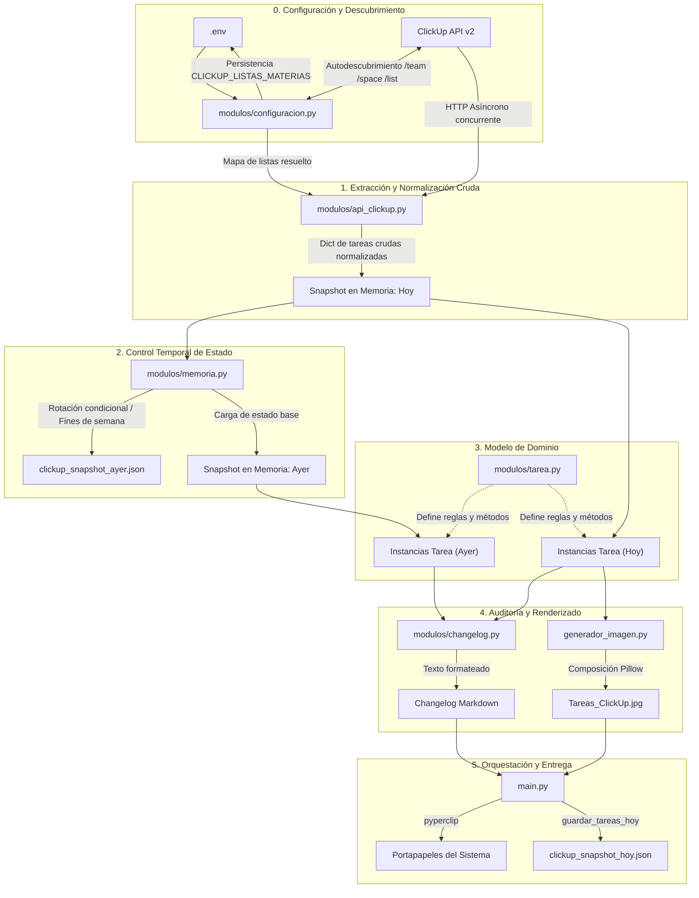
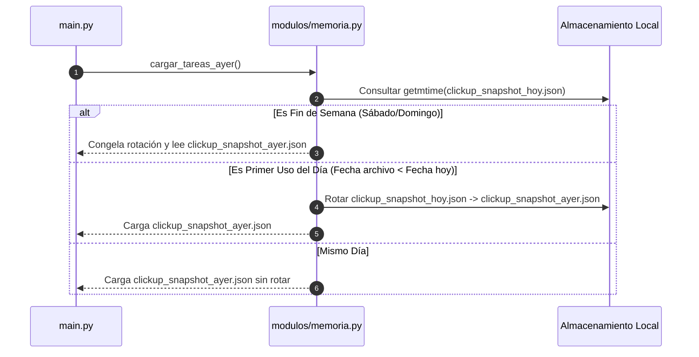
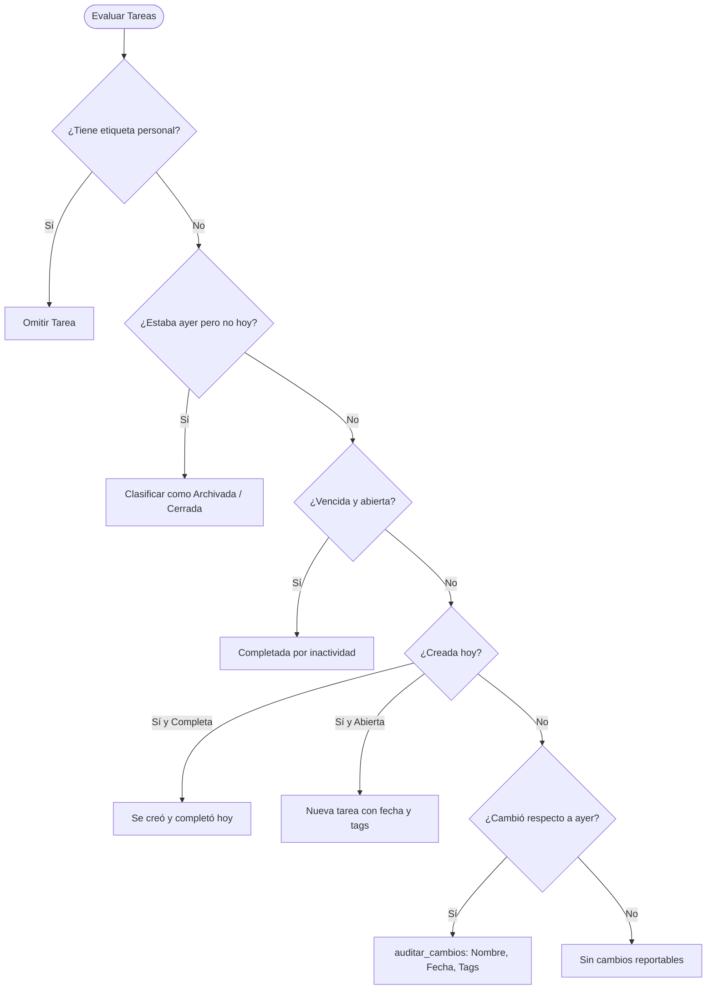

# Explicación: Flujo y Procesamiento de Tareas

Este documento detalla el ciclo de vida y el pipeline de datos que experimentan las tareas académicas a lo largo del sistema, desde su consulta en la API de ClickUp hasta su presentación en el changelog Markdown y la tabla visual en JPEG.

---

## 1. Visión General del Pipeline de Datos

El sistema procesa la información de tareas siguiendo una arquitectura en capas donde cada módulo tiene una responsabilidad única de transformación o auditoría:



---

## 2. Fase 1: Ingesta y Normalización Cruda (`modulos/api_clickup.py` y `modulos/configuracion.py`)

La extracción de datos se realiza mediante peticiones asíncronas concurrentes a los endpoints de ClickUp v2.

### Mecanismo de Consulta Concurrente y Autodescubrimiento
- El módulo `modulos/configuracion.py` resuelve las materias desde `CLICKUP_LISTAS_MATERIAS` en `.env`. Si no está configurada, ejecuta un **autodescubrimiento jerárquico** en la API de ClickUp (`/team` -> `/space` -> `/folder` / `/list`), mapeando automáticamente cada `list_id` con su nombre y persistiendo el resultado en `.env`.
- Con el mapa de listas resuelto, `modulos/api_clickup.py` utiliza `httpx.AsyncClient` y `asyncio.gather` para disparar consultas paralelas a todas las materias configuradas simultáneamente.
- La función `_obtener_tareas_de_lista_async` implementa paginación automática mediante parámetros `page`, `archived=false` e `include_closed=true` para garantizar la obtención de tareas abiertas y cerradas recientemente.

### Limpieza y Normalización Inicial
La función `_procesar_tarea` transforma la estructura anidada y heterogénea provista por ClickUp en un diccionario plano estandarizado:
1. **Identificador único:** Se extrae `task['id']`.
2. **Etiquetas:** Se procesa la lista `task['tags']` convirtiéndola en una cadena de texto separada por comas (`tag1, tag2`).
3. **Materia:** Se inyecta el nombre oficial de la materia resuelto desde el mapeo de listas.
4. **Fechas (`_formatear_fecha_limite` y `_formatear_fecha_creacion`):** Los timestamps en milisegundos de ClickUp se convierten a cadenas legibles con formato `DD/MM/YYYY HH:MM`. Si la hora corresponde a la medianoche (12:00 AM) o a las 04:00 AM (valores por defecto en ClickUp), se omite la hora y se conserva únicamente la fecha `DD/MM/YYYY`.

---

## 3. Fase 2: Control Temporal y Persistencia (`modulos/memoria.py`)

Para poder auditar qué ha cambiado en las tareas, el sistema requiere comparar el estado de hoy contra el estado de ayer.



### Reglas de Persistencia:
- **Rotación Inteligente:** Se detecta el primer inicio del día comparando la fecha de última modificación del archivo de hoy contra la fecha del sistema.
- **Protección de Fines de Semana:** Sábados y domingos no rotan ni sobreescriben snapshots, permitiendo que la comparación del lunes por la mañana mantenga como estado base el snapshot del viernes.

---

## 4. Fase 3: Modelo de Dominio y Reglas de Negocio (`modulos/tarea.py`)

La clase `Tarea` encapsula la lógica de negocio y provee métodos de evaluación para determinar el estado de cada tarea.

### Deserialización e Instanciación
La conversión de diccionarios a objetos tipados se realiza a través del método de fábrica:
```python
tarea = Tarea.desde_diccionario(task_id, datos_dict)
```

### Reglas de Negocio Implementadas:
- **Exclusión de Etiquetas (`tiene_etiqueta_ignorada`):** Si una tarea posee la etiqueta `personal` (definida en `ETIQUETAS_IGNORADAS`), se omite completamente del reporte y de la tabla gráfica.
- **Detección de Finalización (`esta_completada`):** Se considera completada si su estado normalizado pertenece a `ESTADOS_COMPLETADOS` (`closed`, `complete`, `entregada`, `hecha`) o si su fecha límite ya expiró.
- **Autocompletado por Inactividad (`completada_por_inactividad`):** Tareas abiertas cuya fecha de vencimiento (`due_date`) sea anterior a la fecha de hoy se reclasifican como completadas por inactividad.
- **Detección de Tarea Nueva (`es_nueva`):** Compara si la fecha de creación (`date_created`) coincide con la fecha del día en curso.
- **Formateo de Fechas Relativas (`fecha_visual`):** Transforma fechas a expresiones naturales en español (`Hoy a las HH:MM`, `Mañana`, `Lunes`, `DD/MM/YYYY`).

---

## 5. Fase 4: Motor de Auditoría y Composición del Changelog (`modulos/changelog.py`)

La función `generar_texto_changelog` orquesta la comparación entre los mapas de tareas de ayer y hoy:



### Auditoría Granular (`auditar_cambios`)
Para tareas preexistentes que continúan abiertas, se comparan sus campos individuales:
- `_auditar_nombre`: Detecta si el título cambió (`se cambió el nombre de 'X' a 'Y'`).
- `_auditar_fecha`: Detecta prórrogas o adelantos expresados en fechas relativas (`se cambió la fecha del *Hoy* al *Viernes*`).
- `_auditar_etiquetas`: Detecta si se agregaron, removieron o modificaron etiquetas.

### Ensamblado Markdown (`construir_texto_final`)
Los cambios detectados se agrupan bajo bloques Markdown estructurados (`>`):
- `> Tareas completadas`
- `> Nuevas tareas añadidas`
- `> Actualizaciones y correcciones`

Si no hubo diferencias respecto al día previo, se emite el mensaje estándar de cierre.

---

## 6. Fase 5: Preparación y Renderizado Gráfico (`generador_imagen.py`)

El módulo gráfico convierte el conjunto de tareas activas en una tabla visual en alta resolución (JPEG):

1. **Filtrado y Ordenamiento (`preparar_datos_tareas`):**
   - Se excluyen tareas completadas o con etiqueta `personal`.
   - Se calcula el ajuste de texto (`textwrap.wrap`) y la altura dinámica en píxeles de cada fila (`_calcular_alturas_y_texto`).
   - Se ordenan cronológicamente según su fecha de vencimiento (`fecha_ordenamiento`).
2. **Dibujado Modular con Pillow:**
   - **Encabezado:** Barra superior oscura con títulos de columna (`Materia`, `Tarea`, `Fecha Límite`, `Etiquetas`).
   - **Píldoras de Materia:** Cápsula con color representativo asignado en `ESTILOS_MATERIAS`.
   - **Descripción:** Título destacado y líneas de texto secundarias.
   - **Píldoras de Etiquetas:** Renderizado de tags redondeados con soporte para salto de línea en tareas con múltiples etiquetas.
3. **Exportación:** Generación del archivo `Tareas_ClickUp.jpg` con calidad 85%.

---

## 7. Fase 6: Orquestación Asíncrona y Salidas (`main.py`)

El punto de entrada coordina los efectos secundarios:

1. **Paralelismo:** Lanza el renderizado de la imagen en un hilo secundario mediante `asyncio.to_thread(exportar_tabla_imagen, ...)` mientras se evalúa el changelog en la CPU.
2. **Portapapeles:** Copia automáticamente el texto generado al portapapeles del usuario con `pyperclip.copy`.
3. **Persistencia Final:** Invoca `guardar_tareas_hoy` para registrar el estado actual en `clickup_snapshot_hoy.json`.

---

## Documentación Relacionada

- [Referencia técnica de arquitectura y módulos](../reference/arquitectura-y-modulos.md)
- [Ciclo de vida de snapshots y diferencias](ciclo-de-vida-snapshots-y-diferencias.md)
- [Cómo personalizar reglas y etiquetas](../how-to/como-personalizar-reglas-y-etiquetas.md)
- [Volver al inicio del proyecto](../../README.md)
